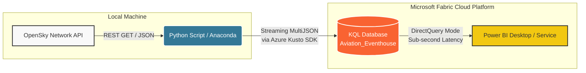
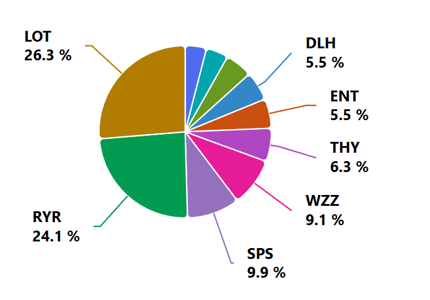
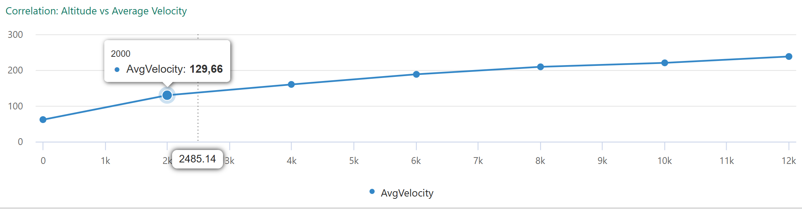
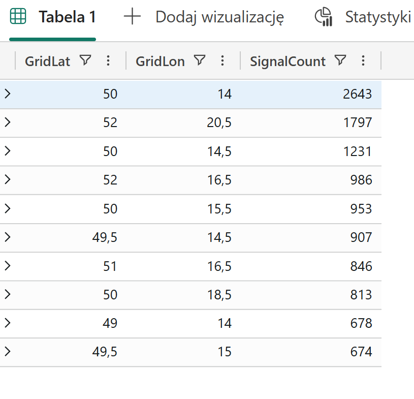

# Real-Time Aviation Data Pipeline with Microsoft Fabric & KQL

A production-ready, real-time data engineering project that streams live aircraft positions over Poland from the OpenSky Network API, ingests them directly into a Microsoft Fabric KQL Database, and visualizes flight telemetry in Power BI via DirectQuery.


## 🚀 Key Highlights & Architectural Decisions

* **Architecture:** Python (Local Anaconda Environment) ➡️ Microsoft Fabric KQL Database (Direct Ingestion via Azure Kusto SDK) ➡️ Power BI Desktop (DirectQuery Mode).
* **Paradigm:** Real-Time Stream Analytics & Time-Series Data Management.
* **Storage:** Leverages Kusto Query Language (KQL) engine for sub-second, multi-million row aggregations.

---

## 🛠️ Engineering Challenges & Resolution Roadmap

Every robust data system encounters real-world friction. Below is a breakdown of the architectural roadblocks faced during development and the engineering solutions implemented to overcome them.

### 1. The Fabric Eventstream Configuration Trap (UI vs. Automation)
* **The Problem:** Initially, the architecture utilized Microsoft Fabric Eventstream's UI components (`Custom Endpoint`). Due to strict, pre-ingestion schema constraints and transient schema registry bugs in the Fabric Preview environment, the UI blocked pipeline saving by enforcing upstream validation before the local Python script could supply the initial data payload.
* **The Solution:** Pivoted from the GUI-driven Eventstream to **Direct Ingestion** using the official `azure-kusto-ingest` Python SDK. By routing the data payload straight to the KQL Database Ingestion URI, the system decoupled schema discovery from pipeline deployment. The KQL engine successfully infers the incoming MultiJSON schema on the fly, eliminating structural bottlenecks.

### 2. Python Package Metamorphosis (`azure-kusto-ingest` Import Quirks)
* **The Problem:** Recent updates to the Azure Kusto SDK introduced major breaking changes, moving core classes (`KustoIngestClient`, `DataFormat`, `IngestionProperties`) into nested namespaces. This triggered repetitive `ImportError` exceptions within the local Anaconda environment due to deprecated import paths found in older documentation.
* **The Solution:** Conducted a structural code refactor to explicitly map the new library topology:
  * Aliased `QueuedIngestClient` as `KustoIngestClient` to handle data spooling.
  * Explicitly imported `DataFormat` from `azure.kusto.data.data_format`.
  This stabilized the ingestion runtime across all Anaconda-managed dependencies.

### 3. Geographical "Bounding Box" Noise vs. Real Borders
* **The Problem:** The OpenSky Network API filters spatial data using a bounding box (rectangular coordinates). Because Poland's geopolitical borders are highly irregular, the API naturally returned "noisy" telemetry data from neighboring airspaces (e.g., Germany, Czechia, Belarus).
* **The Solution:** Instead of embedding complex, CPU-heavy geospatial polygons into the local Python streaming script, the logic was pushed to the target database (**Data Ingestion/Query-time Filtering** pattern). The data was filtered downstream using KQL's high-performance coordinate range operators (`between`), drastically improving data quality without lowering ingestion performance.

### 4. Continuous Append Streams vs. Temporal Deduplication
* **The Problem:** Since the streaming pipeline requests data every 15 seconds, individual commercial flights are logged dozens of times along their trajectory. Treating these repeating records as traditional database duplicates would break relational database logic.
* **The Solution:** Embraced the **Time-Series Log Pattern**. Duplicates were recontextualized as indispensable historical breadcrumbs for flight path reconstruction. For point-in-time "Live Radar" analysis, KQL's powerful `arg_max()` aggregation was used to instantly drop historical latency and fetch only the most recent vector per aircraft.

---

## 📊 Advanced KQL Stream Analytics & Insights

To demonstrate the analytical capabilities of the KQL engine on incoming time-series streams, several production-grade business and operational scenarios were developed using Kusto Query Language.

### 1. Operational Security: Sudden Altitude Drop Detection
* **Objective:** Detect potential aviation safety incidents, transponder failures, or emergency descents by analyzing sequential records.
* **Technical Value:** Demonstrates advanced windowing and sequential analysis utilizing `serialize` and the `prev()` function to calculate row-to-row deltas in a stateless stream.
```kql
RawFlights
| extend PolishTime = datetime_utc_to_local(timestamp, 'Europe/Warsaw')
| order by icao24, timestamp asc
| serialize 
| extend PreviousAltitude = prev(altitude)
| extend AltitudeDrop = PreviousAltitude - altitude
| where AltitudeDrop > 5000 and isnotnull(PreviousAltitude)
| project PolishTime, callsign, icao24, PreviousAltitude, CurrentAltitude=altitude, AltitudeDrop
```

*📂 [INSERT SCREENSHOT: Operational Security Query Results]*

### 2. Market Share & Fleet Profiling: Top Airline Signal Dominance
* **Objective:** Extract business intelligence from raw aircraft telemetry by profiling the prefix of the `callsign` to identify dominant commercial operators in the airspace.
* **Technical Value:** Showcases string manipulation (`substring`), categorical aggregation, and integrated UI data rendering via `| render piechart`.
```kql
RawFlights
| where callsign != "UNKNOWN"
| extend AirlineCode = substring(callsign, 0, 3)
| summarize MessageCount = count() by AirlineCode
| top 10 by MessageCount
| render piechart
```


### 3. Structural Optimization: Altitude vs. Velocity Correlation
* **Objective:** Analyze aerodynamic performance trends by correlating flight speeds across standardized 2,000-meter altitude "buckets".
* **Technical Value:** Validates statistical data binning using `bin()` and trend plotting via `| render linechart`.
```kql
RawFlights
| where altitude > 0 and velocity > 0
| summarize AvgVelocity = avg(velocity) by bin(altitude, 2000)
| order by altitude asc
| render linechart with(title="Correlation: Altitude vs Average Velocity")
```


### 4. Advanced Spatial Analytics: Dynamic Distance from Hub (Warsaw)
* **Objective:** Compute the dynamic, real-time proximity of all airborne objects relative to a central hub (Warsaw Central Coordinates).
* **Technical Value:** Leverages KQL's native geospatial capabilities (`geo_distance_2points`) to calculate spherical earth distances on the fly without external ETL transformation.
```kql
let warsaw_lat = 52.23;
let warsaw_lon = 21.01;
RawFlights
| where latitude > 0 and longitude > 0
| extend DistanceToCapitalKM = geo_distance_2points(longitude, latitude, warsaw_lon, warsaw_lat) / 1000.0
| summarize ClosestToCapitalKM = min(DistanceToCapitalKM) by callsign
| order by ClosestToCapitalKM asc
| top 10 by ClosestToCapitalKM
```
*📂 [INSERT SCREENSHOT: Geospatial Proximity Matrix]*

### 5. Live State Representation: Temporal Deduplication (Radar View)
* **Objective:** Recreate a stateful "Live Radar View" by stripping out historical stream telemetry and isolating only the latest position vector per aircraft.
* **Technical Value:** Maximizes optimization via `summarize arg_max()`, a core KQL function used to resolve time-series histories into state tables.
```kql
RawFlights
| summarize arg_max(timestamp, *) by icao24
| extend PolishTime = datetime_utc_to_local(timestamp, 'Europe/Warsaw')
| project PolishTime, callsign, country, longitude, latitude, velocity, altitude
| order by altitude desc
```
*📂 [INSERT SCREENSHOT: Live State Telemetry Grid]*

### 6. Airspace Density: Most Congested Flight Corridors
* **Objective:** Identify the most heavily trafficked flight corridors and sectors over the airspace by grouping geographic coordinates into spatial grids.
* **Technical Value:** Demonstrates spatial binning using multi-variable `bin()` aggregations to convert continuous latitude/longitude streams into discrete geospatial density matrices (heatmaps).
```kql
RawFlights
| where latitude > 0 and longitude > 0
| summarize SignalCount = count() by GridLat = bin(latitude, 0.5), GridLon = bin(longitude, 0.5)
| top 10 by SignalCount
```

#### 🔍 Empirical Data Insights & Interpretation

The spatial analysis query yielded a highly concentrated traffic matrix across the monitored airspace. Below is an engineering interpretation of the top-performing flight corridors captured during data streaming:

1. **The Western Inbound Funnel (GridLat: 50.0, GridLon: 14.0):** Secured the highest density with over 2,600 logged telemetric events. This specific coordinate sector represents the geopolitical tripoint of Poland, Czechia, and Germany. It functions as a critical high-altitude gateway for transcontinental flights routing from major Western European hubs (e.g., London, Frankfurt) towards Central Europe and Asia.

2. **The Metropolitan Terminal Control Area (GridLat: 52.0, GridLon: 20.5):**
   Registered as the second most congested sector. This grid maps directly to the western approach of the Warsaw metropolitan area. The elevated signal density is driven by commercial aircraft executing standard terminal arrival routes (STAR) for Warsaw Chopin (EPWA) and Warsaw Modlin (EPMO) airports.

